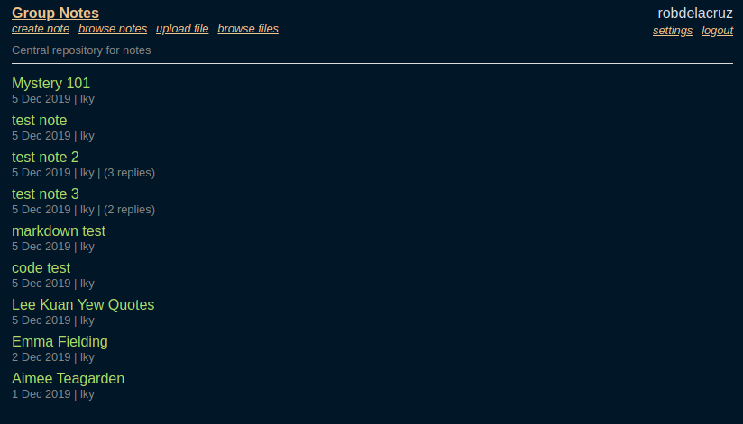
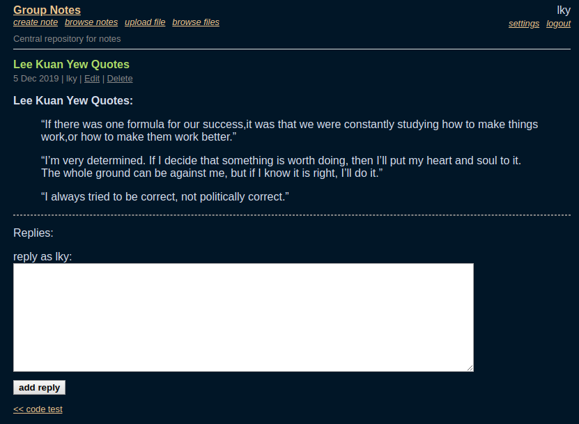
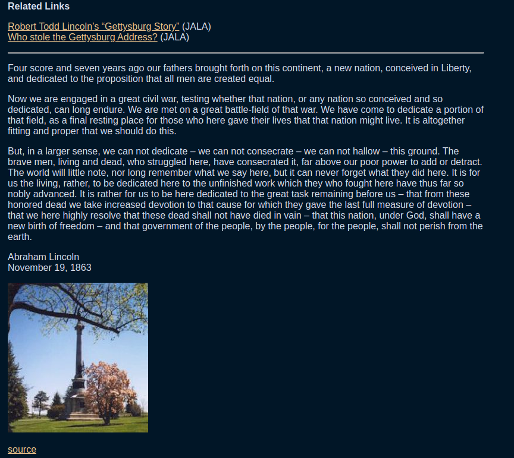
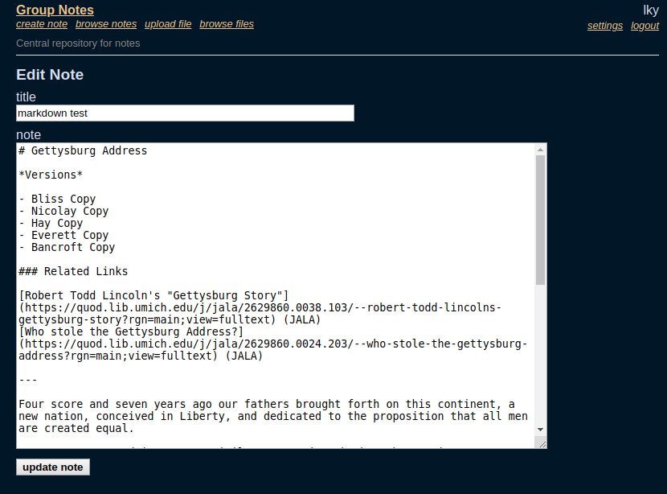
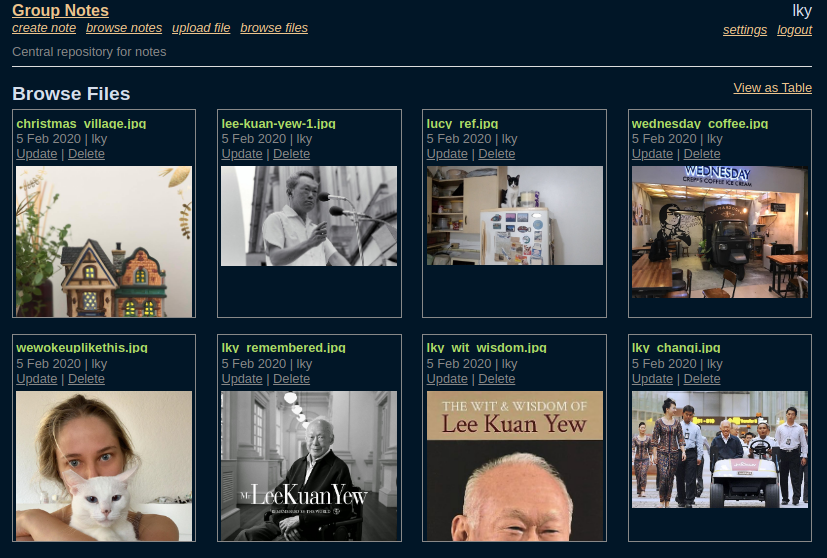

## notes - Barebones group notes website. Inspired by PLATO Notes.

Still in development.

License:
  MIT

## Manual

Build and Install
-----------------
  $ make dep
  $ sqlite3 notes.db < create_tables.sql
  $ make

  Run 'groupnotes' to start the web service.

groupnotes uses a single sqlite3 database file to store all notes, uploaded files, users, and site settings.

## Screenshots

## Contact
  Twitter: @robdelacruz
  Source: http://github.com/robdelacruz/notes

